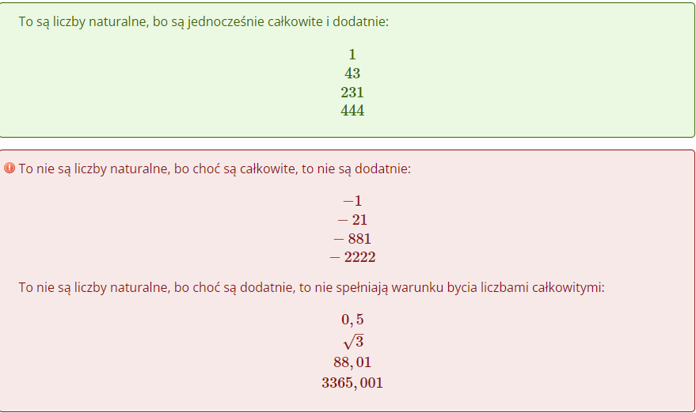

# **Zbiory Liczbowe**

## **Co to są liczby całkowite?**

Konieczność wprowadzania definicji liczb całkowitych wynikła z odkrycia liczb ujemnych i ich naczenia w matematyce. To właśnie dzięki liczbom całkowitym możemy określić np. temperaturę powietrza, niezależnie od tego czy jest ona dodatnia czy ujemna, czy też zapisać wszelkie działania związane z odejmowaniem liczb.

**Liczby całkowite - przykładny:**

**Zbiór liczb całkowitych zapiszemy jako C={..., -4, -3, -2, -1, 0, 1, 2, 3, 4...}**

Z powyższego zapisu jasno wynika, że liczby naturalne stanowią mniejszy zbiór niż ten złożony z liczb całkowitych. Można nawet powiedzieć, że liczby całkowite zawierają wszystkie liczby naturalne (łącznie z zerem) oraz wszelkie ich liczby przeciwne, czyli liczby z ujemną wartością. Z tego też względu mówimy, że zbiór liczb naturalnych wchodzi w skład zbioru liczb całkowitych.

## **Co to są liczby naturalne?**

Liczby naturalne towarzyszą nam niemal na każdym kroku. Za ich pomocą numerujemy budynki, przyporządkowywujemy numer w dzienniku, czy też liczymy liczbę bramek, punktów idt.

**Zbiór liczb naturalnuch zapiszemy jako N = {0, 1, 2, 3, 4, 5...}**

Istnieje kilka sposobów zapisu tego czym są liczby naturalne, ale dla nas najważniejszą informacją jest to, że tworzą ciąg liczb całkowitych, które mają dodatnią wartość. Kwestią sporną jest to czy uznawać zero jako liczbę naturalną, jednak większość stosuje zasadę, że zero pasuje do definicji liczny naturalnej. Często możemy też spotkać się z zapisem **N+**, który oznacza zbiór liczb naturalnych dodatnich, czyli właśnie bez zera.

**Liczby naturalne - przykładny**

## **Co to są liczby rzeczywiste?**

Liczby rzeczywiste są to tak naprawdę wszystkie liczby jakie jesteśmy w stanie sobie wyobrazić, zarówno te wymierne ja i niewymierne. Tym samym zbiór liczb rzeczywistych jest największym zbiorem liczb jaki istnieje w matemayce.

## **Co to są liczby wymierne?**

Określenie co jest liczbą wymierną sprawia wielu osobom dość dużo problemów, dlatego wyjaśnijmy sobie wszystkie nieścisłości jakie mogą budzić naszą wątpliwość.

Co do definicji liczbą wymierną nazwiemy każdą liczbę, którą da się zapisać w formie ułamka zwykłego w postaci p/q gdzie:

-   p - dowolna liczna całkowita
-   q - dowolna liczba całkowita różna od zera

**Zbiór liczb wymiernych zapisujemy symbolem Q**

### **Liczby wymierne - przykłady:**

## **Co to są liczby niewymierne?**

Liczbami niewymiernymi nazywamy wszystkie te liczby, których nie da się zapisać w formie ułamka zwykłego, którego licznik jest liczbą całkowitą, a mianownik jest różny od zera. To oznacza, że jest to przeciwieństwo liczb wymiernych, a co za tym idzie - zbiór liczb niewymiernych i wymiernych nie ma żadnego elementu wspólnego. Połączenie zbioru liczb niewymiernych i wymiernych tworzy zbiór liczb rzeczywistych.

