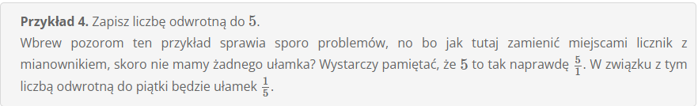
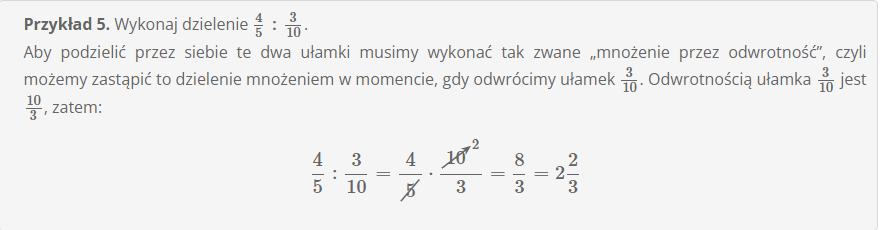
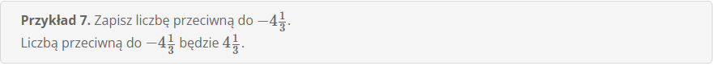

# **Liczba odwrotna i przeciwna**

W tym temacie powiemy sobie czym jest liczba odwrotna oraz liczba przeciwna i podamy sobie kilka problematycznuch przykładów związanych z tymi liczbami.

## **Liczba odwrotna**

powstaje poprzez zamianę miejscami licznika i mianownika. To oznacza, że zanim odwrócimy liczbę to musimy ją zapisać w postaci ułamka zwykłego.

Liczby odwrotne przydają się przede wszystkim podaczas wykonywania dzielenia ułamków, bowiem istnieje zasada, że "dzielenie to mnożenie przez odwrotność" i to właśnie tutaj będziemy korzystać z liczb odwrotnych.

**Przykład 1**

**Przykład 2**

**Przykład 3**

**Przykład 4**

**Przykład 5**

## **Liczba przeciwna**

powstaje poprzez znak na przeciwny (czyli z ujemnej liczby robi się dodatnia, a z dodatniej liczby robi się ujemna).

**Przykład 6**

**Przykład 7**

