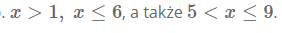
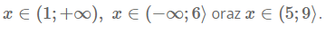
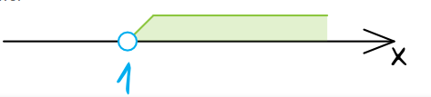
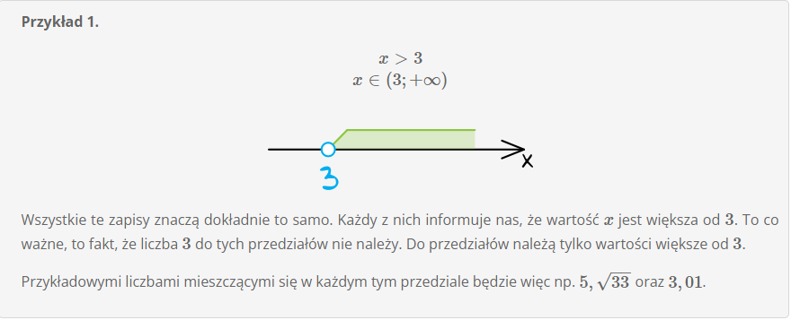
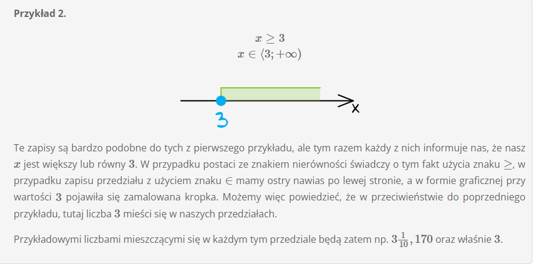
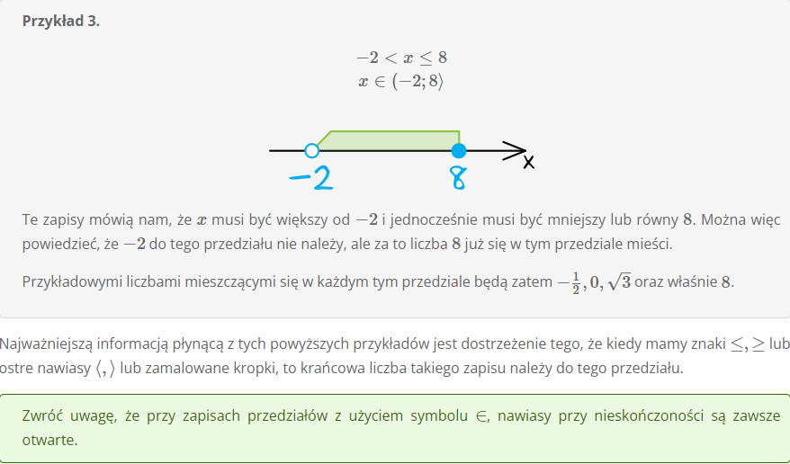

# **Przedziały Liczbowe**

Przedziały liczbowe są matematyczną prezentacją pewnego zakresu liczb, który nas insteresuje. Za pomocą przedziałów będziemy więc mogli zapisać informacje o tym, że jakaś liczba np. większa jest od **7** albo też, że jest większa od **3** i jednoczenśnie mniejsza od **10**.

Przedziały liczbowe zapisujemny zazwyczaj w jednej z trzech form:

-   za pomocą znaków nierówności - Tutaj będziemy posługiwać się czterema znakami:
    . Znaki < oraz > informują nas, że krańcowa liczba nie należy do przedziału. Pozostałe znaki informują nas, że dana krańcowa liczba do tego przedziału należy. Przykładowymi zapisami będą np. 

-   za pomocą zapisu typu x E - W tego typu zapisach będziemy posługiwać się nawiasami otwartymi ( i ) oraz domkniętymi < i >. Nawias otwarty oznacza, że dana krańcowa liczba nie należy do przedziału. Nawias domknięty informuje nas, że dana krańcowa liczba należy do przedziału. Przykładowymi zapisami będą np. .

-   graficznej, czyli na osi liczbowe - Tutaj kluczowe będą kropki, które będziemy rysować przy danej liczbie. Kropka niezamalowana oznaczać będzie, że dana liczba do tego przedziału nie należy, a kropka zamalowana informuje nas, że dana krńcowa liczba mieści się w danym przedziale. Przykładowo:
    

**Przykład 1**

**Przykład 2**

**Przykład 3**

