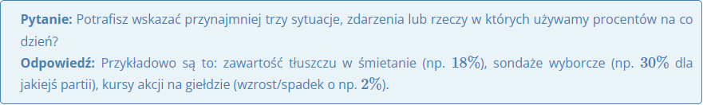

# **Procenty**

Na pewno nieraz spotkałeś się w telewizji, w gazecie, czy też w Internecie z pojęciem procentu lub jego symbolem **%**.
Właśnie w tym dziale będziemy poznawać podstawowe informacje o procentach - dowiemy się czym są, do czego służą i jak je obliczyć w różnych prostych zadaniach.

Wiemy już gdzie są wykorzystywane procenty, więc przejdzmy do omównienia czym jest dokładnie "jeden procent"? Jest to wielkość, którą możemy wyrazić jako:

**1% = 1/100 = 0,01**

Możemy więc powiedzieć, że procent jest po prostu pewną formą zapisu ułamka zwykłego lub dziesiętnego, a to z kolei powzoli nam zamieniać dowolne procenty na ułami i ułamki na procenty. I tak oto:

**47% = 47/100 = 0,47**

**71% = 71/100 = 0,71**

**100% = 100/100 = 1**

Na podstawie tego co sobie do tej pory omówiliśmy, możemy podać kilka życiowych przykładów z zapisywaniem procentów:

-   Jeśli na **100** uczniów tylko **1** uczeń zna język hiszpański, to mówimy że język hiszpański zna **1%** uczniów.

-   Jeśli na **100** ankietowanych **47** osób popiera jakąć akcję, to mówimy że poparcie wyraziło **47%** ankietowanych.

-   Jeśli w grupie **100** osób znajdują się **52** kobiety, to mówimy że kobiet jest **52%**.

Powyższe przykłady były o tyle proste, że zawsze odnosiliśmy się do "setek" (czyli było **100** uczniów, **100** ankietowanych itd.). A co zrobić w sytuacji, kiedy np. na **50** ankietowanych akcję popiera **11** osób? Tutaj przyda nam się umijętność rozszerzania ułamków. Skoro akcję popiera **11** osób z **50**, to popierający stanowią 11/50. My z działu ułamków zwykłych wiemy, że **11/50 = 22/100**, zatem w takim przypadku będziemy mogli powiedzieć, że akcję popiera **22%** osób. Z tego przykładu płynie dla nas wniosek, że chcąc zapisać coś w postaci procentów musimy dążyć do tego by w mianowniku ułamka zwykłego znalazła się liczba **100**.
