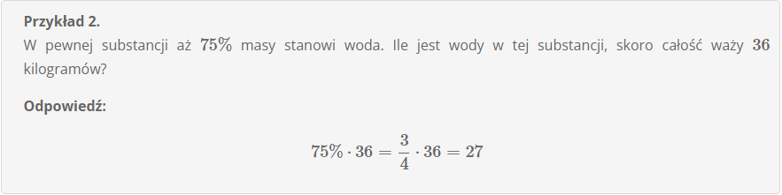

# **Procent z liczby**

Obliczanie procentu z liczby jest proste, bo polega tak na prawdę tylko na wymnożenoi procentu przez daną liczbę. Wystarczy pamięctać, że procenty możemy zamieniać na ułamki zwykle dziesiętne, dzięki czemu cała operacja sprowadza się tylko do prawidłowego wymnożenia liczb. Spójrzmy na przykłady:

**Przykład 1**

**Przykład 2**

