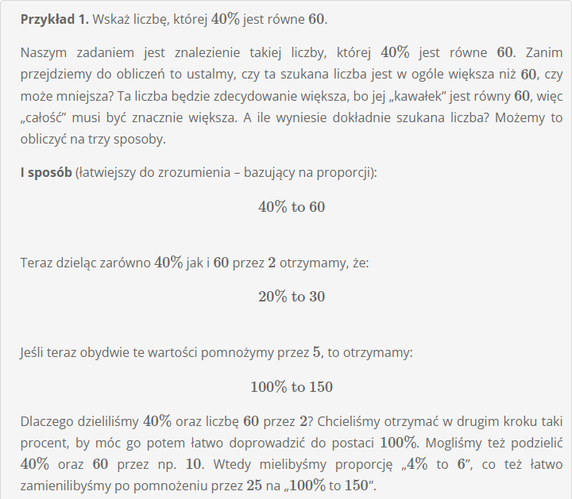
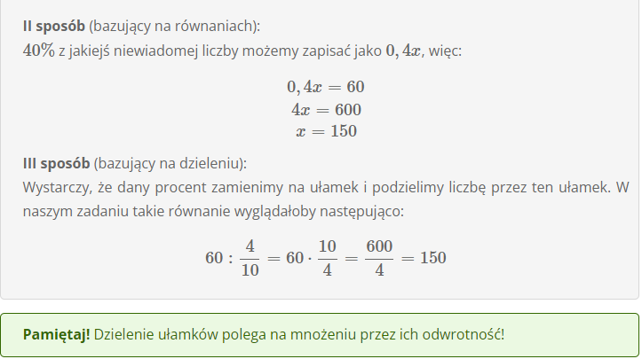
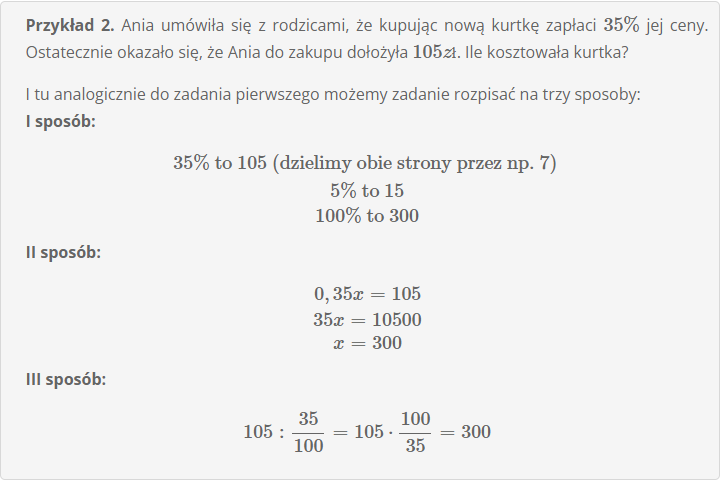

# **Obliczanie liczby, gdy dany jest jej procent**

Obliczanie liczby, gdy dany jest jej procent to jedno z najpopularniejszych zadań z jakimi możemy spotkać się w dziale precentów. Przyjrzyjmy się jak powinniśmy poprawnie je wykonywać, tak aby w przyszłości uniknąć błędów.

**Przykład 1**

**Przykład 2**

