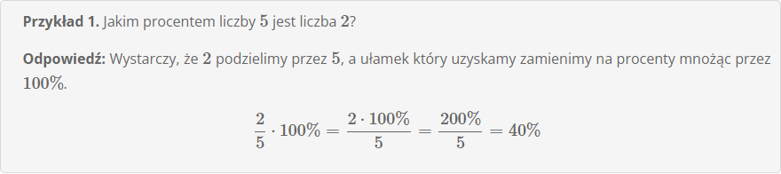

# **Jakim procentem jednej liczby jest druga liczba**

Chcąc obliczyć jakim procentem jednej liczby jest druga liczba wystraczy podzielić te dwie liczby przez siebie, a otrzymaną wartość zamienić na procenty. Spoójrzmy na przykładowe zadania:

**Przykład 1**

**Przykład 2**

