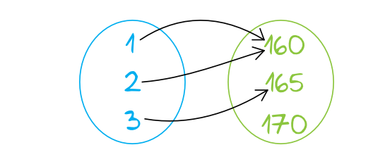
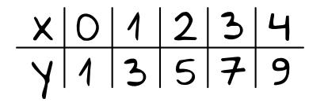
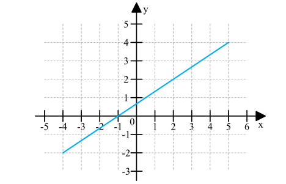

# **Funkcje**

Funkcje to jeden z największych działów w matematyce, a dobre zrozumienie tego zagadnienia pomaga w opanowaniu kolejnych działów. Powiedzmy sobie zatem czym są funkcje, o co w nich chodzi i jak je możemy opisywać?

## **Co to jest funkcja**

Funkcją matematyczną nazwyamy przyporządkowanie każdemu elementowi zbioru **x** dokładnie jeden element zbioru **y**. Fachowo w matematyce zbiór iksów nazwać będzie agrumentami funkcji, natimiast zbiór igreków wartościami funkcji. Ta definicja brzmi skomplikowanie, dlatego aby lepiej zrozumieć istotę funkcji to omówimy to na konkretnych przykładach.

-   Jeżeli każdemu dziecku przyporządkujemy liczbę mówiącą o tym ile centymetrów ma wzrostu, to będzie to funkcja - bo jednemu dziecku przyporządkujemy jedną liczbę np. Jaś - 170, Małgosia - 160 itd.

-   Jeżeli każdemu dziecku przyporządkujemy liczbę mówiąć o tym ile ma rodzeństwa, to będzie to funckja - bo jednemu dziecku przyporządkujemy jedną liczbę np. Jaś - 3, Małgosia - 0.

-   Jeżeli każdemu dziecku przyporządkujemy liczbę mówiąć o tym jaką ma na świadectwie ocenę z matematyki, to możemy dwóm różnym uczniom (argumentom) możemy przyporządkować te same oceny (wartości).

## **A co nie będzie funkcją**

-   Jeśeli do porzczególnych pomiarów wzrosu przyporządkujemy imiona dzieci, to nie będzie to funkcja - bo pomiar np. 160cm może mieć kilka uczniów.

-   Jeżeli do liczby rodzeństwa przyporządkujemy imiona dzieci, to nie będzie to funkcja - bo np. dwójkę rodzeństwa może mieć kilka osób.

-   Jeżeli każdemu dziecku przyporządkujemy zdobyte oceny ze wszystkich przedmiotów, to nie będzie to funkcja - bo jedno dziecko będzie miało więcej niż jedną ocenę np. Jaś-5-4-3-4-2, Małgosia-3-4-6-6-5.

Z tego płyną dla nas dwa główne wnioski:

1. Jeden argument **x** ma jedną odpowiadającą mu wartość **y**.
2. Argumenty **x** są niepowtarzalne, wartości **y** mogą się powtórzyć.

Nas w matematyce oczywiście będą interesować przede wszystkim te funkcje, które da się opisać liczbami, a najlepiej kiedy da się opisać je jakimiś zależnościami, które zapiszemy póżniej w formie wzoru.

## **Różne formy prezentacji funkcji**

Funkcje możemy zobrazować na cztery sposoby:

-   Graf - nie jest to może zbyt popularna forma prezentacji funkcji, ale świetnie obrazuje to czym są funkcje. Każdemu elementowi z lewego zbioru przyporządkowana jest jakaś wartość ze zbioru drugiego. Przykładowy graf wyglądałby następująco:

Zwróć uwagę na to, że każdej liczbie ze znioru argumentów **x** przyporządkowana jest jakaś wartość **y** i może się zdarzyć, że dla dwóch różnych argumentów przyporządkowana będzie ta sama wartość.

-   Tabelka - często jest wykorzystywana do rysowania wykresów funkcji. Na górze tabelki wypisujemy argumenty funkcji (czyli iksy), a na dole odpowiadające tym argumentom wartości (czyli igreki).

-   Wykres - jest to prezentacja graficzna w układzie współrzędnych. Do narysowania wykresów takich funkcji często będziemy wyznaczać współrzędne charakterystycznych punktów, które do tej funkcji należą.

-   Wzór - zdecydowanie najlepszy i najbardziej popularny sposób prezentacji funkcji. Przewagą wzoru nad innymi postaciami jest to, że dzięki wzorom możemy w prosty sposób poznać dowolne wartości funkcji dla dowolnych agrumentów. Bardzo często też ze wzoru będziemy odczytywać lub obliczać kluczowe informacje na teamt funkcji (np. czy jest rosnąca, gdzie ma miejsca zerowe, gdzie przecina się z osią igreków itd.). Wzory funkcji zapisujemy w postaci np:

f(x) = x + 5 lub y = x + 5
