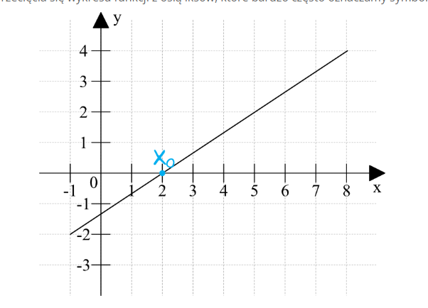
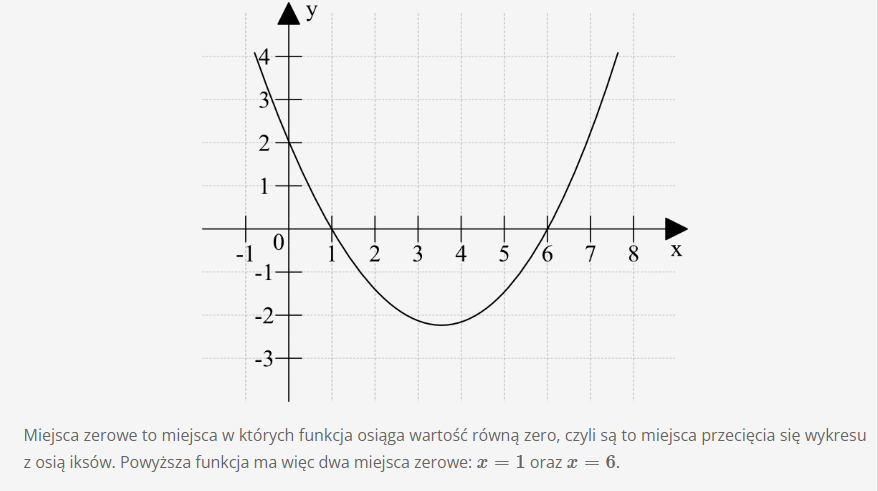

# **Miejsca zerowe funkcji**

Miejsce zerowe funkcji to taki argument x dla którego funkcja przyjmuje wartość y = 0. Obrazowo rzecz ujmując będzie to miejsce przecięcia się wykresu funkcji z osią iksów, któe bardzo często oznaczamy symbolem xo.

Bardzo często spotykamy się z zadaniami typu: "Wyznacz miejsca zerowe funkcji (i tu pada wzór funkcji)". Jak takie zadania powinniśmy rozwiązywać? Spójrzmy na prosty przykład:

**Przykład 1**
Wyznacz miejsce zerowe funkcji f(x) = 2x + 8.

Chcemy wyznaczyć miejsce zerowe, czyli sprawdzić dla jakiego argumentu powyższa funkcja przyjmuje wartość równą 0. Możemy więc albo pod f(x) podstawić zero, otrzymując równanie 0 = 2x + 8, albo teź wytłumaczyć sobie to w ten sposób, że chcemy sprawdzić kiedy 2x + 8 jest równe zero, dzięki czemu otrzymamy identyczne równanie 2x + 8 = 0. To w jaki sposób będziemy sobie podchodzić do zadania jak widać nie ma większego znaczenia, bo otrzymaliśmy identyczne równania. W zaiązku z tym:

2x + 8 = 0
2x = -8
x = -4

Miejscem zerowym funkcji jest zatem x = -4

**Przykład 2**

