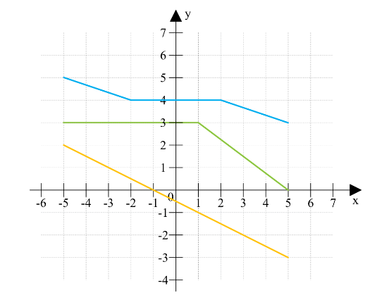

# **Monotoniczność funkcji**

Funkcje możemy podzielić na monotiniczne i niemonotoniczne. Do funkcji monotonicznych możemy zaliczyć funkcje rosnące, malejące oraz stałe (to są trzy główne rodzaje), a także funkcje niemalejące i nierosnące. Do funkcji niemonotonicznych zaliczamy wszystkie pozostałe, które nie są funkcjami monotonicznymi.

Spójrzmy na przykłady poszczególnych funkcji monotonicznych:

**Funkcja rosnąca** to taka, która dla każdego kolejnego argumentu x przyjmuje coraz wieśkszą wartość. Przykłądowymi funkcjami rosnącymi są:

**Funkcja malejąca** to taka, która dla każdego kolejnego argumentu x przyjmuje coraz mniejszą wartość. Przykładowymi funkcjami malejącymi są:

**Funkcja niemalejąca** to taka, która w pewnych przedziałach jest stała lub rosnąca. Przykładowymi funkcjami niemalejącymi są:

**Funkcja nierosnąca** to taka, która w pewnych przedziałach jest stała lub malejąca. Przykładowymi funkcjami nierosnącymi są:

Kiedy funkcja nie spełnia żadnego z powyższych kryteriów, czyli są przedziały w których funkcja rośnie i są przedziały w których maleje, to taka funkcja nazywana jest niemonotoniczną. Bardzo często opisując taką funkcję niemonotoniczną określa się właśnie dla jakich przedziałów funkcja np. rosnąca, a dla jakich malejąca. Przykładowymi funkcjami niemonotonicznymi są:

