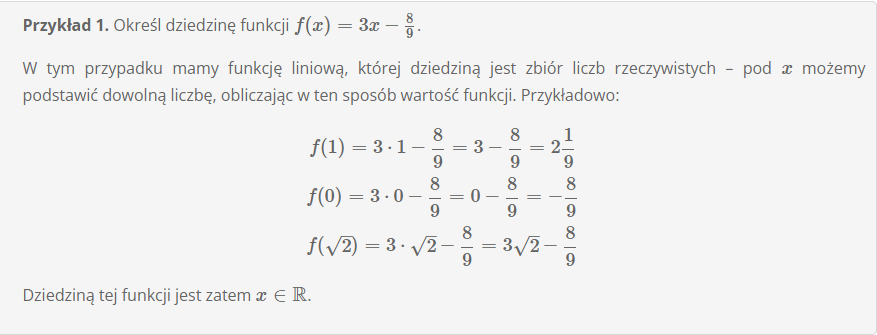

# **Dziedzina funkcji**

Dziedzina funkcji to zbiór wszystkich agrumentów (czyli iksów) dla których funkcja przyjmuje jakąś wartośc. Bardzo często dziedziną funkcji jest po prostu zbiór liczb rzeczywistych, co oznacza że funkcja przyjmuje wartość dla dowlonego argumentu x. Tak też będzie w przypadku standardowych funcji liniowych czy kwadratowych, dzięki czemu do wzorów takich funkcji możemy podstawić dowolne liczby. Czasami jednak będziemy mieć do czynienia z sytacją, w której z jakichś powodów dziedzina funkcji będzie mnie lub bardziej ograniczona.

## **Co może powiedzieć iż dziedzina będzie zawierała jakieś wykluczenia?**

Zawężenie dziedziny może wynikać przede wszystkim z następujących sytacji:

1. x znajdujący się w mianowniku ułamka np. y = 5/x - jeżeli nasza niewiadoma x znajduje się w mianownuiku ułamka, to musimy uwzględnić fakt iż w matameyce nie istnieje dzielenie przez 0, czyli że mianownik musi być rózny od zera.

2. x zmajdujący się pod pierwiastkiem parzystego stopnia to trzeba pamiętać, że nie da się obliczyć pierwiastka z liczb ujemnych.

3. x znajdujący się w logarytmach trzeba pamiętać że podstawa logarytmu musi być liczba większą od 0 i różną od 1, a liczba logarytmowana musi być większa od 0.

Z tych trzech powyższych sytuacji zdecydowanie najpopularniejszą jest ta pierwsza i to ona jako jedyna występuje na matematyce na poziomie podtawowym.

